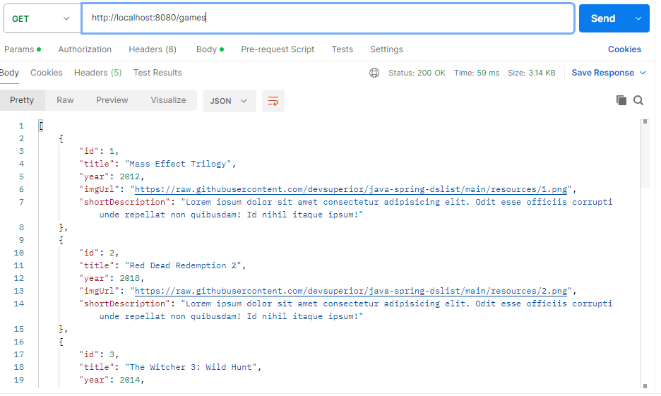

## 🛠 Imagem do Projeto

## Modelo de domínio DSList

## 🛠 Tecnologias utilizadas

- **[Java 17]**
- **[Spring Boot]**
- **[JPA / Hibernate]**
- **[Maven]**
- **[H2]**
- **[Postman]**
- 
## Como executar o projeto 

Pré-requisitos: Java 17

 # clonar repositório
git clone https://github.com/JacquelineCasali/dslist-java

# entrar na pasta do projeto back end

# executar o projeto
./mvnw spring-boot:run

Autora
Jacqueline Casali

https://www.linkedin.com/in/jaquelinecasali/

